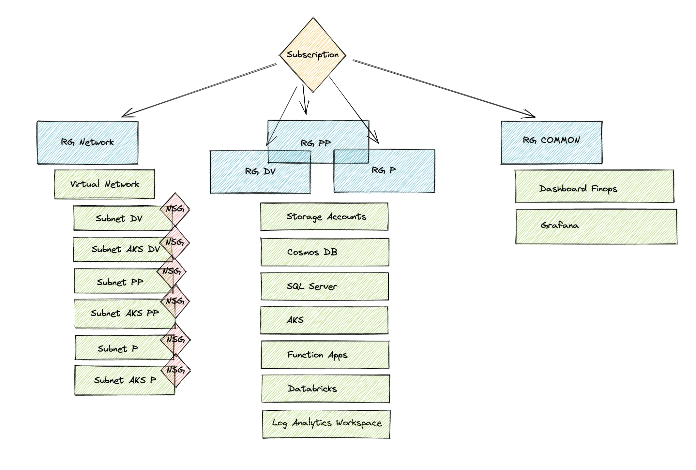

# Terraform Azure Skeleton

> This project aims to setup a Terraform structure and instanciate some basics resources for starting an Azure Project.

It respects some standard that can be found at: <https://dawtio.notion.site/>

## Architecture Schema

